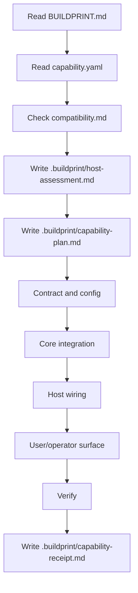
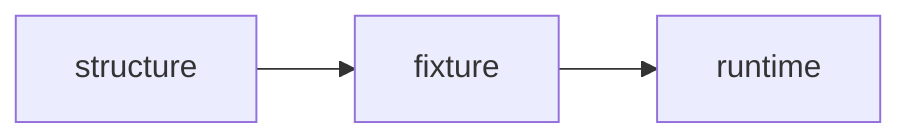

# API Key Management Capability Buildprint

This Capability Buildprint packages a guarded workflow for adding secure API key management to an existing SaaS or B2B app.

It is designed for coding agents. It is not a copy-paste auth tutorial.

## What it adds

- API key generation with one-time secret display
- keyed/versioned hash-only key storage with searchable high-entropy key prefixes
- key scopes or permissions
- revocation and rotation/replacement flow
- request authentication middleware or helper
- audit events for key lifecycle and usage
- verification and receipt requirements

## What the host app must already have

- authenticated user identity or explicitly approved service-account owner model
- persistence layer or approved persistence decision
- server-side API route/action capability
- account, team, organization, or owner model for keys
- environment/config pattern when hashing parameters or secrets are configured

## Execution profile

`guarded`

API keys grant programmatic access to host data and actions. The applying agent must assess the host, plan the graft, implement through phases, verify, and write a receipt.

## Agent flow



## Proof levels



Use the highest honest level. Do not claim runtime proof without testing the host API surface.

## Dogfood proof

This packet has been applied to copied real host apps:

- `examples/agb-website-server-runtime-receipt.md`
- `examples/hono-open-api-starter-runtime-receipt.md`
- `examples/nextjs-prisma-boilerplate-runtime-receipt.md`
- `examples/evidence-matrix.md`

The Bun proof added user-owned API keys, hash-only SQLite storage, signed-in key management routes, a Bearer-key protected export route, and runtime tests for valid, missing, malformed, wrong-scope, and revoked keys.

The Hono proof adapted to a service-account owner model because the host has no user/session auth. It added Drizzle-backed API keys, admin-token operator routes, HMAC-SHA256 hash material with versioning, high-entropy prefix generation with collision retry, a protected `GET /tasks/export` route, and caught real implementation bugs in key format parsing, prefix strength, full-secret verification, route param schema, and typed OpenAPI responses.

The Next/Prisma proof applied the packet to a real NextAuth/Prisma app as user-owned API keys. It added a Prisma `ApiKey` model, user key routes, a Bearer-key protected post export route, and unit proof for hash-only storage, valid-prefix/wrong-secret denial, revocation, wrong-scope denial, ownership-safe revoke, and last-used updates. Its production build is explicitly not proven because the old Next 12 stack fails SWC/OpenSSL loading on this ARM/Node 24 host.

Verification result:

```text
bun test
12 pass
0 fail
59 expect() calls

pnpm test -- --run
13 pass
pnpm typecheck
pnpm lint
pnpm build
all passed

yarn types
yarn test:server:unit --runInBand
yarn lint
passed

yarn build
blocked by old Next 12 SWC/OpenSSL/ARM host mismatch
```

## Non-negotiables

- No source edits before host assessment and capability plan.
- No plaintext key storage.
- No recoverable secret after initial creation.
- No client-side-only API key validation.
- No access without owner/tenant boundary checks.
- No install success claim without valid, revoked, wrong-scope, and valid-prefix/wrong-secret proof.
