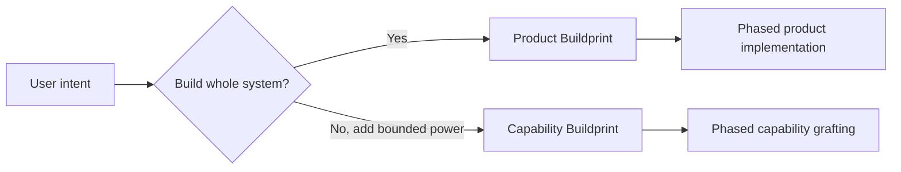
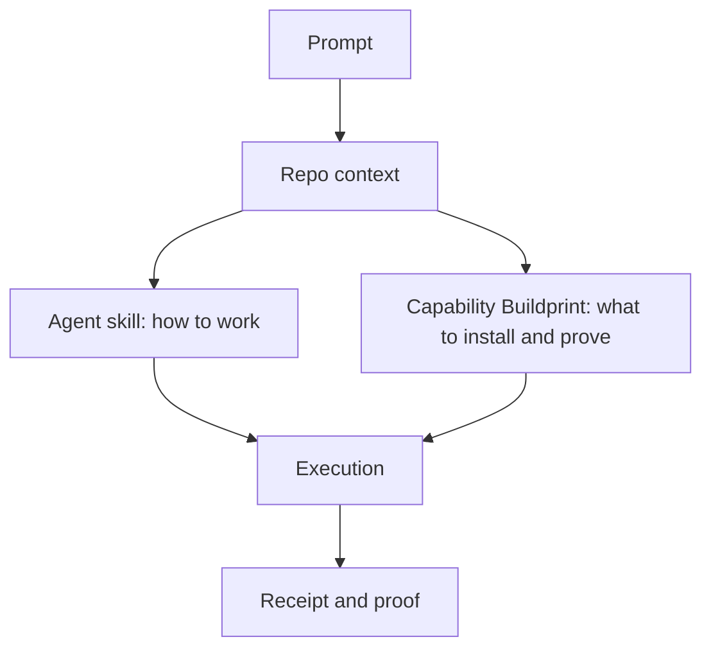
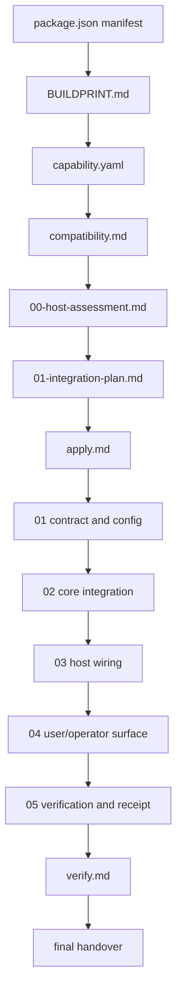
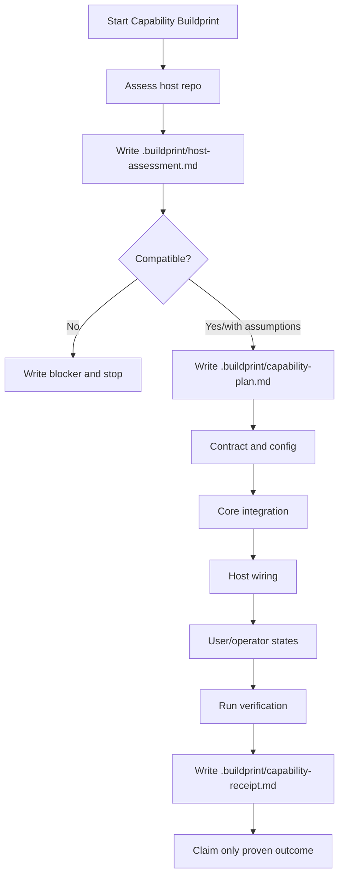
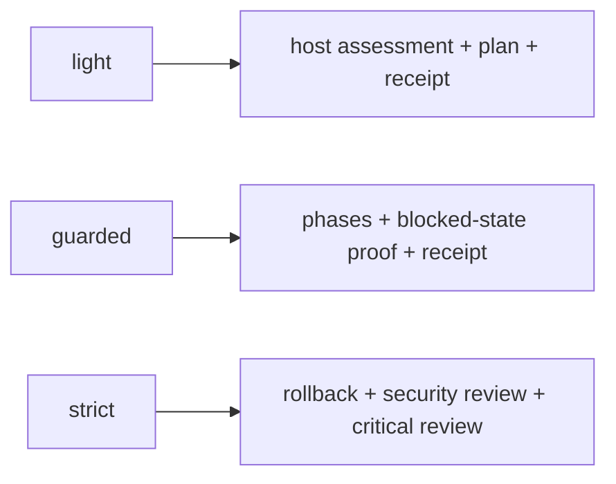
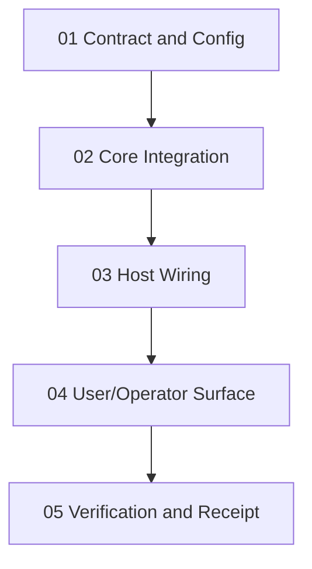
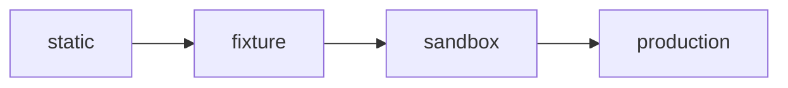
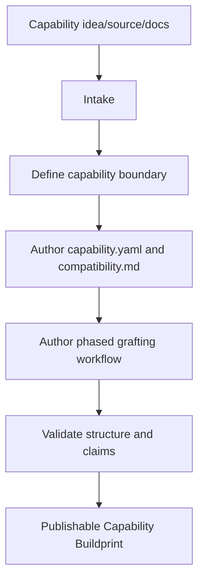
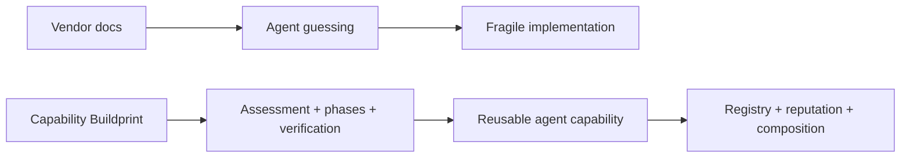

# Capability Buildprint Standard

Capability Buildprints are reusable implementation packets for coding agents.

Product Buildprints build whole systems. Capability Buildprints add bounded powers to existing systems: billing, RBAC, auth, analytics, deploys, admin UI, webhooks, search, email, background jobs, provider integrations, and similar reusable capabilities.

## Standard Sentence

A Capability Buildprint is an agent-readable implementation contract for grafting one reusable software capability into a compatible host project through assessment, planning, phased implementation, verification, and receipt.

## Why This Exists

Prompting an agent to add Stripe, RBAC, auth, analytics, or deployment forces it to rediscover the same implementation contract every time:

- vendor docs
- host architecture
- secrets and env names
- route conventions
- auth/session model
- database and migrations
- UI/operator states
- verification commands
- failure modes
- rollback or recovery paths

A Capability Buildprint packages that contract so another coding agent can fetch it, inspect the host repo, adapt safely, apply bounded changes, and prove what worked.

## Product Vs Capability Buildprints



Product Buildprints create a product world: setup, UI identity, architecture, phases, verification, handover.

Capability Buildprints enter an existing world: assess the host, map the capability to that host, implement through bounded phases, verify, and write a receipt.

## Relationship To Agent Skills

Agent Skills teach reusable procedure. Capability Buildprints package reusable implementation contracts.



An agent can use both. The skill gives general discipline. The Capability Buildprint gives the specific contract for Stripe subscriptions, RBAC, Supabase auth, or another bounded capability.

## Core Packet Shape

```text
BUILDPRINT.md
capability.yaml
compatibility.md
00-host-assessment.md
01-integration-plan.md
apply.md
02-implementation-phases/
  01-contract-and-config.md
  02-core-integration.md
  03-host-wiring.md
  04-user-operator-surface.md
  05-verification-and-receipt.md
verify.md
README.md
examples/
scripts/
references/
schemas/
publication.json
```

Optional directories exist only when they carry real value. Do not add decorative folders.

## File Responsibilities

`BUILDPRINT.md`
: Canonical start file. Defines agent role, read order, non-negotiables, and the rule that no implementation starts before host assessment and integration planning.

`capability.yaml`
: Machine-readable capability contract. Declares capability identity, execution profile, supported hosts, required inputs, touched surfaces, apply contract, verify contract, risk, failure modes, and composition rules.

`compatibility.md`
: Explains host detection, framework support, required vs optional host features, composition, conflicts, and when to block.

`00-host-assessment.md`
: Forces no-edit inspection of the host repo. The applying agent writes `.buildprint/host-assessment.md`, classifies important findings, and stops on implementation-changing questions.

`01-integration-plan.md`
: Forces a host-specific plan before edits. The applying agent writes `.buildprint/capability-plan.md` and reconciles assessment blockers, assumptions, and baseline health.

`apply.md`
: Routes the phased workflow. It is not a vague "do this" file.

`02-implementation-phases/`
: Contains the bounded implementation phases.

`verify.md`
: Defines proof levels and success/blocker rules.

`README.md`
: Human-readable overview of the capability packet.

`publication.json`
: Registry metadata when publishing to Agent Buildprint.

## Read Order For Applying Agents



The generated package manifest must expose this read order. Agents should fetch the manifest and raw files instead of scraping website cards.

## Capability Application Flow



This flow exists to prevent false-positive plans. A nice plan is not enough. The agent must create durable checkpoints and then prove the capability.

## Discovery Decision Gate

Every Capability Buildprint must force host findings into one of four buckets:

- `infer safely`
- `patch locally`
- `must ask user`
- `out of scope`

The applying agent must stop before source edits when a `must ask user` finding changes product behavior, auth or tenant boundaries, data ownership, security posture, migration strategy, provider side effects, external billing, or destructive operations. Verification must reconcile against the assessment and plan; broken baseline checks, failed schema validation, unresolved hard stops, or unplanned blockers downgrade the claim to partial or blocked.

## Local Checkpoints

Every applying agent must create:

```text
.buildprint/host-assessment.md
.buildprint/capability-plan.md
.buildprint/capability-receipt.md
```

`host-assessment.md` records what the repo actually is.

`capability-plan.md` maps the generic capability to this repo.

`capability-receipt.md` records changed files, proof level, passed checks, blocked checks, not-proven claims, and rollback/recovery notes.

## Execution Profiles

Capability Buildprints do not always need the full Product OS skill harness. They use execution profiles instead.



`light`
: Low-risk additive helpers such as analytics snippets, simple UI helpers, local formatters, small adapters.

`guarded`
: Auth, billing, RBAC, webhooks, database changes, provider integrations, durable state. Most serious capabilities use this.

`strict`
: Destructive operations, production data migration, public deployment, security boundary changes, broad cross-cutting automation.

Example:

```yaml
execution_profile: guarded
required_disciplines:
  - host-assessment
  - integration-plan
  - phased-implementation
  - blocked-state-proof
  - verification-receipt
```

## capability.yaml Minimum Contract

```yaml
schema: agent-buildprint/capability.v0
name: stripe-subscriptions
type: capability
capability: billing.subscriptions
description: Adds Stripe Checkout subscriptions, signed webhook handling, and persisted entitlement checks to compatible web apps.
execution_profile: guarded
host_frameworks:
  - nextjs
host_detection:
  package_files:
    - package.json
  route_signals:
    - app/api
    - pages/api
  auth_signals:
    - session helper
requires:
  env:
    - STRIPE_SECRET_KEY
    - STRIPE_WEBHOOK_SECRET
  existing_capabilities:
    - auth.user_identity
  human_decisions:
    - subscription product and price
touches:
  - dependencies
  - env.example
  - billing service
  - checkout route
  - webhook route
  - entitlement persistence
apply:
  inspect:
    - package manager and framework router
    - auth/session helper
    - database migration path
  steps:
    - add provider wrapper
    - add checkout endpoint
    - add signed webhook endpoint
    - persist entitlement state
  forbidden:
    - hard-code secret keys
    - trust unsigned webhook payloads
verify:
  proof_level: sandbox
  runtime_checks:
    - checkout session can be created
    - signed webhook updates entitlement state
    - protected entitlement check reads persisted state
risk:
  level: high
  reason: Touches billing, external callbacks, entitlement state, and secrets.
failure_modes:
  - webhook secret mismatch
  - duplicate webhook events
  - subscription canceled but entitlement remains active
composition:
  expects:
    - auth.user_identity
  provides:
    - billing.subscription_state
    - billing.entitlement_check
  composes_with:
    - rbac-permissions
  conflicts_with:
    - existing billing provider without migration decision
```

## Implementation Phases



### 01 Contract And Config

Add dependencies, env examples, config loaders, local provider interfaces, schema/migration plan, and missing-config blocked states. Do not claim behavior yet.

### 02 Core Integration

Build the core helper/service/provider wrapper. Keep it bounded and testable. Represent success and failure paths.

### 03 Host Wiring

Connect the core capability to real host routes, actions, middleware, jobs, persistence, or components. An unused helper is not an installed capability.

### 04 User Operator Surface

Expose visible setup, blocked, success, denied, audit, billing, admin, or recovery states when the capability affects users/operators.

### 05 Verification And Receipt

Run checks, inspect user/operator paths, and write `.buildprint/capability-receipt.md`.

## Proof Levels



`static`
: Files and configuration exist. Not enough for runtime claims.

`fixture`
: Local fixture proves the path without external side effects.

`sandbox`
: External sandbox provider proves live integration with non-production credentials.

`production`
: Production credentials and real side effects are configured and audited.

Never imply a higher proof level than the receipt records.

## Authoring Flow

Use `capability-buildprint-author` when creating new Capability Buildprints.



The Author Buildprint exists so agents can create Capability Buildprints consistently, the same way Agent Skills use a simple standard plus reusable authoring conventions.

## Registry And Scanner Signals

A phased Capability Buildprint should earn these registry signals:

- `capability-manifest`
- `capability-contract`
- `capability-phases`
- `capability-schema`
- `complete-capability`

The scanner should downgrade packets that include `capability.yaml` but omit host assessment, integration plan, apply/verify rules, or implementation phases.

## Common Capability Families

- `billing.subscriptions`
- `auth.rbac`
- `auth.supabase`
- `admin.dashboard`
- `analytics.events`
- `deploy.docker`
- `deploy.vercel`
- `webhooks.receiver`
- `email.transactional`
- `search.fulltext`
- `jobs.background`
- `ai.chat-provider`

## First Examples

- `examples/stripe-subscriptions/capability.yaml`
- `examples/rbac-permissions/capability.yaml`

These examples are not full vendor implementations. They define the shape future packets should satisfy.

## Non-Negotiables

- Do not implement before host assessment and integration plan exist.
- Do not ship a capability packet without concrete verification.
- Do not hide secrets, webhooks, migrations, auth, billing, provider, or destructive side effects behind vague prose.
- Do not claim support for a framework unless host signals and file patterns are named.
- Do not count mocks, screenshots, or sample data as live proof.
- Do not silently overwrite host architecture.
- Do not produce generic integration docs. A Capability Buildprint is an executable implementation contract.

## The Moat

The value is not "AI writes docs." The value is a reusable, verifiable, composable implementation contract that agents can use repeatedly.



Product Buildprints build systems. Capability Buildprints add powers to systems. Together they form an agent-readable software construction layer.
