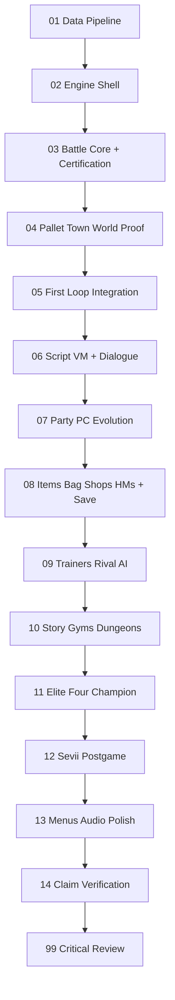

# Phase Flow

Work active phase only. Do not read every phase upfront. Read `03-phases/phase-index.yaml`, open only the active phase and its named prerequisite notes, then execute the loop below. This prevents context bloat and stale phase assumptions.

## Active phase loop

For every active phase:

1. Observe current repo, AGENTS.md, `.buildprint/next-agent.md`, setup receipt, UI identity, docs/DESIGN.md, game runtime, screenshots, tests, and story progress.
2. Thinking checkpoint: name the smallest real vertical user/operator path this phase can make playable or more truthful.
3. Predict 3-7 likely failure modes before editing.
4. Write a proof plan: commands, screenshots, playtest path, save/readback, data validator, or claim-gate artifact.
5. Implement the smallest real repair or phase slice.
6. Compare the result against the predicted failure modes.
7. Repair one concrete weakness before advancing unless the weakness is externally blocked.
8. Record what the proof does not prove and the current claim ceiling.

This review loop is not a deliverable file. Do not create phase-run paperwork by default. Compare the result against the predicted failure modes, perform one concrete weakness repair, and record what the proof does not prove. Use `.buildprint/next-agent.md`, `.buildprint/playthrough-receipt.md`, `.buildprint/ui-evidence.md`, and HANDOVER only when they materially preserve state.

## Dependency graph



## Story contract (read before phase 06)

| File | Role |
|---|---|
| `data/story/story-graph.yaml` | Quest order, flags, mandatory events |
| `data/story/map-manifest.yaml` | 88 Kanto + 18 Sevii required maps |
| `data/story/rival-progression.yaml` | 8 rival battles |
| `data/story/sevii-quest-chain.yaml` | Full islands 1-7 postgame |

## Maturity progression

| After phase | Max honest claim |
|---|---|
| 01 | data_pipeline (sprites cached — not yet visual proof) |
| 02 | data_pipeline (engine foundation is not a gameplay claim) |
| **03 battle core** | **battle_core** — requires recomputed functional proof plus independent visual pass |
| **04 Pallet Town world proof** | **starter_town_core** — requires semantic map validation, runtime traversal, and independent visual pass |
| **05 first loop integration** | **overworld_core** — requires continuous Pallet → Route 1 → Viridian traversal and real encounter return flow |
| 08 | progression_core |
| 11 | kanto_complete |
| 12 | postgame_sevii |
| 13-14 | release_polish (if proof passes) |

## Playtest checkpoints

Agents must playtest and record in `.buildprint/playthrough-receipt.md`:

| ID | After | Proof |
|---|---|---|
| **CP-BATTLE** | Phase 03 | Deterministic production wild and trainer fixtures pass mechanics, real-input, PokeAPI sprite, recompute, and independent visual gates |
| **CP-PALLET** | Phase 04 | Walk every required Pallet exterior path; landmarks, compound tiles, collision, layering, render, and independent visual review pass |
| **CP-A** | Phase 05 | Walk Pallet → Route 1 → Viridian without clipping, debug teleport, or discontinuity |
| **CP-B** | Phase 05 | Trigger a canonical Route 1 encounter; Win and Run both restore correct overworld state through the certified battle system |
| **CP-C** | Phase 08 | Potion in battle; save/load preserves party; Cut after Brock |
| **CP-D** | Phase 10 | Defeat Brock levels 8-12 |
| **CP-M1** | Phase 10 | SS Anne complete, HM Cut, rival SS Anne battle |
| **CP-M2** | Phase 10 | Silph Co cleared, Tea/Saffron passed, Rocket Hideout done |
| **CP-M3** | Phase 10 | 8 badges, Safari Surf+Strength, both Snorlax cleared |
| **CP-E** | Phase 11 | Hall of Fame after Champion |
| **CP-F** | Phase 12 | One Island + Celio intro |
| **CP-SeviiComplete** | Phase 12 | Network Machine complete, National Dex, islands 1-7 accessible |

**Mid-story checkpoints CP-M1..M3 are hard gates for phase 10 completion** — not optional.

## Validation commands

```bash
npm run battle:proof:verify -- --recompute
npm run pallet:proof:verify -- --recompute
npm run maps:validate
npm run story:validate
npm run story:lint
```

Phase 10 cannot complete unless `maps:validate` = 100% and `story:validate` = all kanto quests complete.

Phase 12 cannot complete unless all sevii quests in `sevii-quest-chain.yaml` are complete.

## Content authoring parallel track

After phase 06 script VM:

- `data/maps/source/` — one semantic layout per `map-manifest.yaml` id, using `data/maps/tile-catalog.yaml`
- `data/maps/generated/` — deterministic TMX compiler output for Tiled preview and production runtime; never edit directly
- `data/manual/trainers/` — JSON per trainer id
- `data/scripts/maps/` — per-map scripts keyed by story-graph

Vertical slice first (Pallet → Viridian → Pewter), then expand per story-graph quest order.

## Sprite and evidence hard gates

Phases cannot advance without required artifacts on disk. Prose-only handoff is invalid.

| Phase | Sprite / visual blocker | Required evidence |
|---|---|---|
| 01 | PokeAPI FRLG front/back cached for starters + Route 1 species | `assets:validate` pass + sprite sample screenshot |
| 02 | Pixel config declared (`pixelArt`, integer scale) | evidence-phase-02 + title screenshot 2× |
| **03 battle** | Production BattleScene uses cached PokeAPI foe front + player back sprites and has no visual UI defects | battle proof JSON, trace, required desktop/mobile states, independent battle review |
| **04 Pallet Town** | Committed world tiles/player sheet; semantic stamps assemble compound tiles without seams, collage, or bad layering | scoped Pallet proof, full-map render, traversal trace, required desktop/mobile states, independent Pallet review |
| **05 integration** | Same certified battle and world implementations connect through canonical Route 1 encounter data | CP-A + CP-B continuous trace and same-commit battle/Pallet/integration receipts |
| 10 | 88 Kanto maps are distinct, rendered, reachable, and continuously traversable at story checkpoints | map-audit.json + 88 renders/contact sheet + world traversal trace + independent visual review |
| 12 | 18 Sevii maps pass the same world proof and are reachable from the persisted Champion save | Sevii renders/contact sheet + continuous traversal trace + independent visual review |

**Phase 06 and all later phases are blocked** until `05-first-loop-integration` passes and the current battle, Pallet, and integration receipts bind the same commit. Do not start story scripting with an uncertified battle, weak starter town, placeholder art, or partial Run-only flow.

## Phase discipline

- Complete minimum proof before advancing `active_phase` in phase-index.yaml
- Verify every artifact named by the active phase exists on disk before advancing past a gate phase
- Update `.buildprint/story-progress.json` every session
- Lower claim in HANDOVER if any hard gate fails
- Edits alone, placeholder screens, mocked data, functionless buttons, raw JSON viewers, and decorative menus do not prove product progress; do not fake live success.
- Before final completion, require `99-critical-review-pushback` in `03-phases/critical-review-pushback.md`. Final mandatory phase: if the rubric does not pass, fix real ad hoc flaws and rerun proof instead of claiming done.

## UI identity verification gate

Completion is blocked by:

- missing local UI identity
- missing local design system
- missing UI evidence binder
- missing `.buildprint/ui-evidence.md`
- missing `docs/DESIGN.md`
- no action stronger than "type and send"
- missing screenshot evidence
- missing or stale `.buildprint/battle-slice-proof.json` or independent battle visual review
- missing or stale `.buildprint/pallet-world-proof.json` or independent Pallet visual review
- missing or stale world-proof binding, render index, traversal trace, or independent world review

Run or document:

```bash
agb verify ui .
```

The UI evidence must prove title, overworld, battle, party, bag, dialogue, shop, faint, victory, desktop, and 375px mobile/narrow states.

## Repair routing

- If hard-stop decisions are missing, return to `00-questions.md`.
- If setup, architecture, stack, harness, or project structure is weak, return to `01-project-setup.md`.
- If UI identity, design tokens, screenshots, or action surface is weak, return to `02-ui-identity.md`.
- If a phase cannot honestly pass, keep the active phase unchanged and record blocker/next repair.
