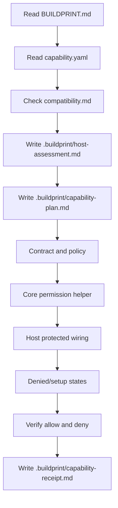
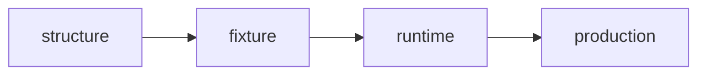

# RBAC Permissions Capability Buildprint

This Capability Buildprint packages a guarded workflow for adding role-based access control to an existing host app.

It is designed for coding agents. It is not a vague authorization checklist.

## What it adds

- explicit roles
- explicit permissions
- deny-by-default permission matrix
- central authorization helper
- protected route/action wiring
- denied and missing-role states
- fixture/runtime verification requirements

## What the host app must already have

- authenticated user identity
- at least one route/action/API surface worth protecting
- a role storage, derivation, or configuration path
- a local test or fixture path for allow/deny proof

## Execution profile

`guarded`

RBAC touches security boundaries. The applying agent must assess the host, plan the graft, implement through phases, verify allowed and denied access, and write a receipt.

## Agent flow

## Proof levels

Unlike provider integrations, RBAC can usually reach `fixture` or `runtime` proof without external keys.

## Non-negotiables

- No source edits before host assessment and capability plan.
- No privileged default role.
- No client-only protection.
- No scattered permission literals.
- No success claim without denied-path proof.

