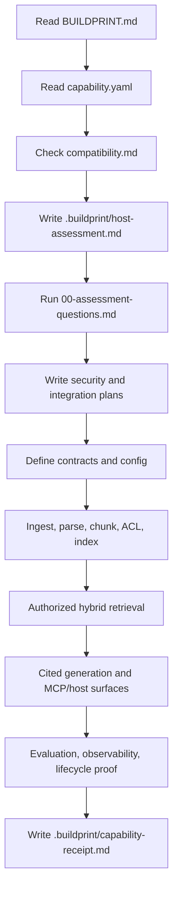
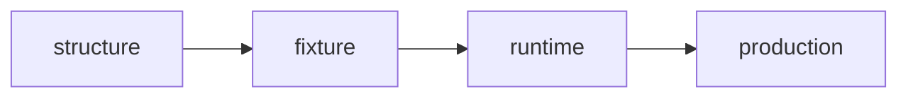

# Secure Hybrid RAG MCP Capability Buildprint

This Capability Buildprint packages a strict workflow for adding secure, measurable Retrieval-Augmented Generation to an existing host app.

It is designed for coding agents. It is not a vector database checklist and not a generic "add embeddings" prompt.

## What it adds

- document ingestion with receipts
- structured parsing and chunking
- ACL metadata on documents and chunks
- pre-retrieval authorization
- dense vector retrieval
- keyword/full-text retrieval
- deterministic hybrid fusion
- optional reranking behind a feature flag
- cited evidence responses
- structured generation outputs
- RAG evaluation fixtures and metrics
- retrieval receipts and observability
- reindex/delete lifecycle controls
- MCP-compatible tools or equivalent host service methods

## What the host app must already have

- authenticated user or service-principal identity
- tenant, team, project, customer, account, document, or equivalent ownership boundaries
- an authorization source for deciding which subject may read which document
- durable storage for document metadata, chunks, indexes, and receipts
- a file upload, import, or document source path
- background job or worker capacity for ingestion and indexing
- local validation commands that can prove allow and deny behavior

If the host cannot resolve identity, permissions, or ACL assignment, this capability must stop before implementation.

## Execution profile

`strict`

Secure RAG touches private documents, auth boundaries, derived indexes, model context, logs, deletion behavior, and sometimes offer/pricing/legal outputs. The applying agent must assess the host, run the assessment question gate, write a security-aware integration plan, implement through phases, verify negative and positive paths, and write a receipt.

## Security invariant

Access control happens before retrieval.

The capability is invalid if it searches the whole corpus and filters forbidden chunks afterward. Dense vector search, keyword search, fusion, reranking, citation, generation, logs, and evaluation fixtures must all operate only on the authorized corpus.

In practical terms:

```text
resolve subject -> compute allowed corpus -> dense search + keyword search -> fuse -> rerank -> cite -> generate
```

Not:

```text
search everything -> remove forbidden chunks later
```

## Preferred baseline stack

Use equivalent host systems when they already exist. Otherwise the default MVP path is:

- parser: Docling
- data store: PostgreSQL
- vector search: pgvector
- keyword search: PostgreSQL full-text search
- fusion: Reciprocal Rank Fusion
- reranker: optional provider or local reranker behind a feature flag
- evaluation: golden set plus context precision, context recall, faithfulness, answer relevance, field accuracy, and permission-leak checks

The durable contract is the architecture and proof behavior, not a specific vendor.

## Agent flow



## Discovery question gate

Capability questions happen after host assessment. The agent should inspect the repo first, then ask only what blocks safe integration.

Hard-stop questions include:

- Which identity source is authoritative?
- Which tenant/project/customer/document boundaries apply?
- Which permission source controls document access?
- Can ACL metadata be assigned at ingestion time?
- Can dense and keyword retrieval share the same authorization pre-filter?
- Are external parsers, embedding models, rerankers, or generation providers approved for private documents?
- What must deletion remove: raw files, chunks, embeddings, keyword index rows, cached summaries, receipts?

Hard-stop answers cannot be guessed. They must be confirmed, explicitly delegated, or recorded as blockers.

## Proof levels



The first useful proof level is `fixture`: one allowed retrieval, one denied retrieval, cited output, and a small golden set. A stronger `runtime` proof exercises the actual host route, worker, database, and MCP/API surface.

## Non-negotiables

- No source edits before host assessment, assessment questions, and capability plan.
- No chunks indexed without ACL metadata.
- No post-retrieval filtering as the security boundary.
- No separate auth logic for vector and keyword paths.
- No uncited generated answers for evidence-backed tasks.
- No offer, price, quantity, legal, or safety claim without evidence or uncertainty.
- No raw sensitive chunk logging by default.
- No success claim without allowed and denied retrieval proof.
- No deletion claim unless derived indexes and caches are removed or invalidated.

## Where to start

Start with `BUILDPRINT.md`. The README is a human overview; the Buildprint files are the executable contract.
