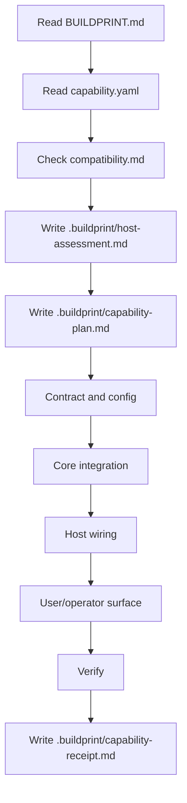
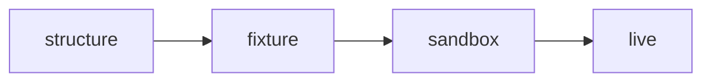

# Stripe Subscriptions Capability Buildprint

This Capability Buildprint packages a guarded workflow for adding Stripe subscription billing to an existing host app.

It is designed for coding agents. It is not a copy-paste billing tutorial.

## What it adds

- Stripe Checkout subscription session creation
- signed Stripe webhook handling
- persisted customer/subscription/entitlement state
- entitlement helper for protected host surfaces
- setup/blocked states for missing configuration
- verification and receipt requirements

## What the host app must already have

- authenticated user identity
- server-side route/action capability
- persistence layer or approved persistence decision
- environment/config pattern

## Execution profile

`guarded`

Billing touches money, secrets, provider callbacks, persistence, and access control. The applying agent must assess the host, plan the graft, implement through phases, verify, and write a receipt.

## Agent flow

## Discovery decision gate

Before edits, the applying agent must classify important host findings as `infer safely`, `patch locally`, `must ask user`, or `out of scope`. Questions that change user identity, entitlement model, billing provider migration, subscription state ownership, persistence/migration strategy, Stripe product/price mapping, webhook delivery, or access-control behavior are hard stops, not assumptions.

The final receipt must reconcile every blocker, assumption, baseline failure, and hard-stop question with the claimed proof level.

## Proof levels

Use the highest honest level. Do not claim sandbox or live proof without real Stripe checks.

## Non-negotiables

- No source edits before host assessment and capability plan.
- No hard-coded secrets.
- No unsigned webhook trust.
- No paid entitlement from checkout redirect alone.
- No install success claim without persisted entitlement readback or explicit blocker.
- No sandbox/live proof claim when baseline schema/build/test validation remains broken without an explicit blocked or partial receipt.
